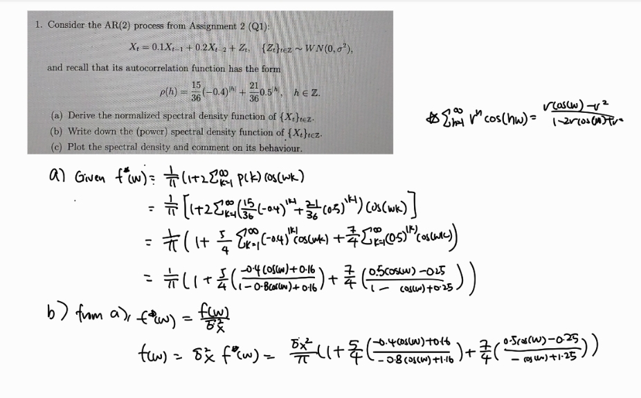

```{r setup, include=FALSE}
knitr::opts_chunk$set(echo = TRUE)
#if you do not have the package, type install.packages("name_of_the_package")
library(knitr)
library(tseries)
library(ggplot2)
```

### Question 1
(a & b)
```{r, echo=TRUE}

```

(c)

```{r, echo=TRUE}
# Calculate the spectral density
spectral_density <- function(omega) {
  term2 <- (15/18) * ((-0.4*cos(omega) - 0.16) / (1.16 + 0.8 * cos(omega)))
  term3 <- (21/18) * ((0.5*cos(omega) - 0.25) / (1.25 - cos(omega)))
  
  return((1/pi) * (1 + term2 + term3))
}

# Create a sequence of frequencies from 0 to pi
omega <- seq(0, pi, length.out = 1000)

# Calculate the spectral density for each frequency
spec_values <- sapply(omega, spectral_density)

# Create a data frame for plotting
spec_df <- data.frame(
  omega = omega,
  frequency = omega/(2*pi),
  spectral_density = spec_values
)


# Plot using ggplot2
ggplot(spec_df, aes(x = omega, y = spec_values)) +
  geom_line() +
  labs(title = "Spectral Density : AR(2) Process",
       x = "Frequency",
       y = "f(w)") +
  theme_minimal()
```
We can the spectral density being dominated by low frequencies, with 
the spectral density is at highest at frequency = 0 as it's peak.
As we move further away from frequency 0, we observe
a dip / decreasing spectral density and another smaller peaks
at approximately frequency 3. Overall, this suggests that
our AR(2) process has long term dependencies.


### Question 3

(a) 

```{r, echo=TRUE}
# this is where your R code goes
```


(b)

```{r, echo=TRUE}
# this is where your R code goes
```

(c)

```{r, echo=TRUE}
# this is where your R code goes
```

(d)

```{r, echo=TRUE}
# this is where your R code goes
```

(e)

```{r, echo=TRUE}
# this is where your R code goes
```

(f)

```{r, echo=TRUE}
# this is where your R code goes
```

(g)

```{r, echo=TRUE}
# this is where your R code goes
```

(h)

```{r, echo=TRUE}
# this is where your R code goes
```