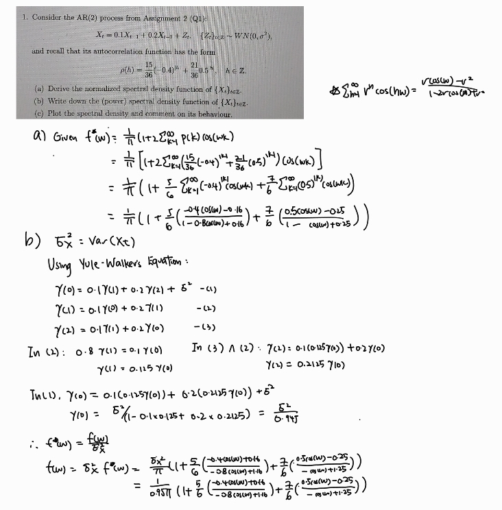
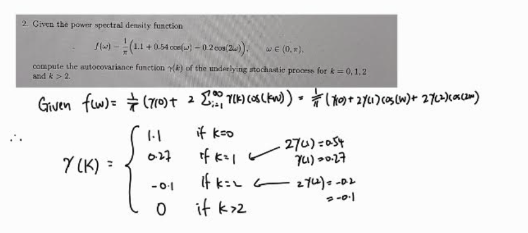

```{r setup, include=FALSE}
knitr::opts_chunk$set(echo = TRUE)
#if you do not have the package, type install.packages("name_of_the_package")
library(knitr)
library(tseries)
library(ggplot2)
```

### Question 1
(a & b)
```{r, echo=TRUE}

```

(c)

```{r, echo=TRUE}
# Calculate the spectral density
spectral_density <- function(omega) {
  term2 <- (15/18) * ((-0.4*cos(omega) - 0.16) / (1.16 + 0.8 * cos(omega)))
  term3 <- (21/18) * ((0.5*cos(omega) - 0.25) / (1.25 - cos(omega)))
  
  return((1/(0.95*pi)) * (1 + term2 + term3))
}

# Create a sequence of frequencies from 0 to pi
omega <- seq(0, pi, length.out = 1000)

# Calculate the spectral density for each frequency
spec_values <- sapply(omega, spectral_density)

# Create a data frame for plotting
spec_df <- data.frame(
  omega = omega,
  frequency = omega/(2*pi),
  spectral_density = spec_values
)


# Plot using ggplot2
ggplot(spec_df, aes(x = omega, y = spec_values)) +
  geom_line() +
  labs(title = "Spectral Density : AR(2) Process",
       x = "Frequency",
       y = "f(w)") +
  theme_minimal()
```
We can the spectral density being dominated by low frequencies, with 
the spectral density is at highest at frequency = 0 as it's peak.
As we move further away from frequency 0, we observe
a dip / decreasing spectral density and another smaller peaks
at approximately frequency 3. Overall, this suggests that
our AR(2) process has long term dependencies.


### Question 2
```{r, echo=TRUE}

```

### Question 3
(a) 
```{r, echo=TRUE}
predator<- read.csv("predator_prey.csv")

rot_ts <- ts(predator$rotifers..animals.ml.)

plot(rot_ts,
     main = "Rotifer Population Over Time",
     ylab = "Population Density (Animals / ML)"
     )
```

We observe a consistent fluctuation until at time ~350 where we
observe a large spike / peak before dropping back to the consistent
fluctuation.

(b)

```{r, echo=TRUE}

raw_spec <- spectrum(rot_ts,
                     log = "no",
                     main = "Raw Periodogram of Rotifer Time Series")

frequencies <- raw_spec$freq
spectrum_values <- raw_spec$spec

# Get the max 
max_index <- which.max(spectrum_values)

dominant_freq <- frequencies[max_index]
dominant_freq

angular_freq <- 2 * pi * dominant_freq
angular_freq

wavelength_days <- 1 / dominant_freq
wavelength_days
```
For our dominating frequency 0.144, we get wavelength (days) ~ 6.944
and angular frequency ~ 0.905

(c)
```{r, echo=TRUE}

N <- length(rot_ts)

num_cycles <- N / wavelength_days
num_cycles

```
On a cycle length of approximately 7 days, we get the predator prey 
cycles to be approximately 52.7

(d)
```{r, echo=TRUE, fig.height = 7}
spec_smooth <- spec.pgram(rot_ts, 
                          spans = c(366 / 40), # As per piazza response @116
                          log = "no",
                          main = "Smoothed Periodogram Rotifer Population")
```
We may want to change the raw periodogram since we know it is not a
consistent estimator of the spectral density function and change it
to an estimator that is more consistent. As per piazza response @116, 
I chose N / 40 over 2 *sqrt(N) for my span smoothing because I believe
it includes several peaks and dips relatively better.

(e)

```{r, echo=TRUE}

N <- length(rot_ts) # 366

omega_59 <- (2 * pi * 59) / N 
omega_59

```
Our Fourier Frequency for p = 59 is 1.012863.

(f)
```{r, echo=TRUE}
N <- length(rot_ts)  # 366

# Create an empty data frame to store significant frequencies
significant_freqs <- data.frame(
  p = integer(),
  freq = numeric(),
  angular_freq = numeric(),
  wavelength = numeric(),
  F_stat = numeric(),
  p_value = numeric()
)

# Loop through potential frequencies (Fourier components)
for (p in 1:(N/2)) {
  t <- 1:N  # Time vector
  omega_p <- 2 * pi * p / N  # angular frequency

  # Fit the linear model 
  model <- lm(rot_ts ~ cos(omega_p * t) + sin(omega_p * t))

  # Extract F-statistic and p-value from model summary
  model_summary <- summary(model)
  f_stat <- model_summary$fstatistic[1]
  p_value <- pf(f_stat,
                model_summary$fstatistic[2],
                model_summary$fstatistic[3],
                lower.tail = FALSE)

  # Store results if significant at 99% confidence level (p < 0.01)
  if (p_value < 0.01) {
    significant_freqs <- rbind(significant_freqs, data.frame(
      p = p,
      freq = p / N,
      angular_freq = omega_p,
      wavelength = N / p,
      F_stat = f_stat,
      p_value = p_value
    ))
  }
}

# Sort significant frequencies by F-statistic (DESC)
significant_freqs <- significant_freqs[order(-significant_freqs$F_stat), ]

print(significant_freqs)
```


(g)
```{r, echo=TRUE}

top_freqs <- head(significant_freqs, 3) # top 3 significant frequencies
N <- length(rot_ts)  # 366
t <- 1:N  # Time index

# Start building the formula as a string
formula_terms <- c()

# Loop through each top frequency and construct sin-cos terms
for (i in 1:nrow(top_freqs)) {
  p <- top_freqs$p[i]
  omega_p <- 2 * pi * p / N  # angular frequency

  formula_terms <- c(
    formula_terms, 
    paste0("cos(", omega_p, " * t)"), 
    paste0("sin(", omega_p, " * t)")
  )
}


formula_str <- paste("rot_ts ~", paste(formula_terms, collapse = " + "))
data_frame <- data.frame(t = t, rot_ts = rot_ts)

# Fit linear model 
model_fit <- lm(as.formula(formula_str), data = data_frame)

summary(model_fit)

```


(h)
```{r, echo=TRUE, fig.height = 6}
# Prediction
pred_vals <- predict(model_fit)

plot(rot_ts,
     ylab="Population Density (animals / ML)",
     main="Rotifer Population: Original vs Fitted Model")


lines(pred_vals, col="red", lwd=2)
legend("topright", legend=c("Original Data", "Fitted Model"),
col=c("black", "red"), lty=1)

```